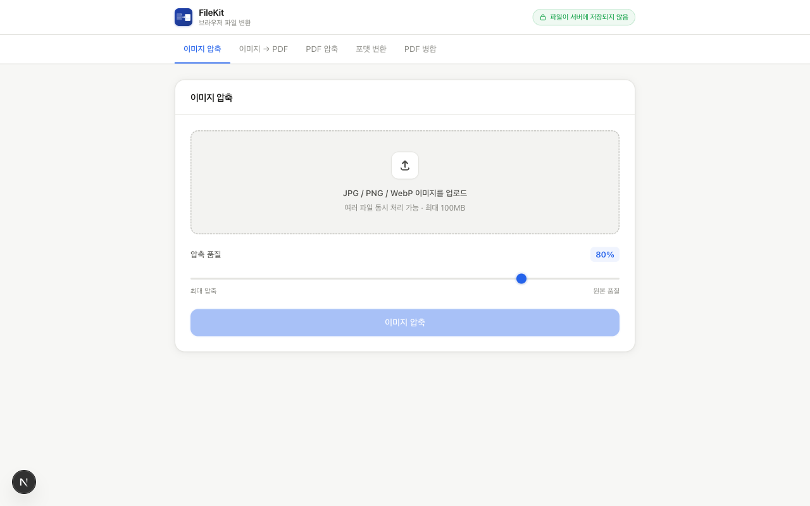
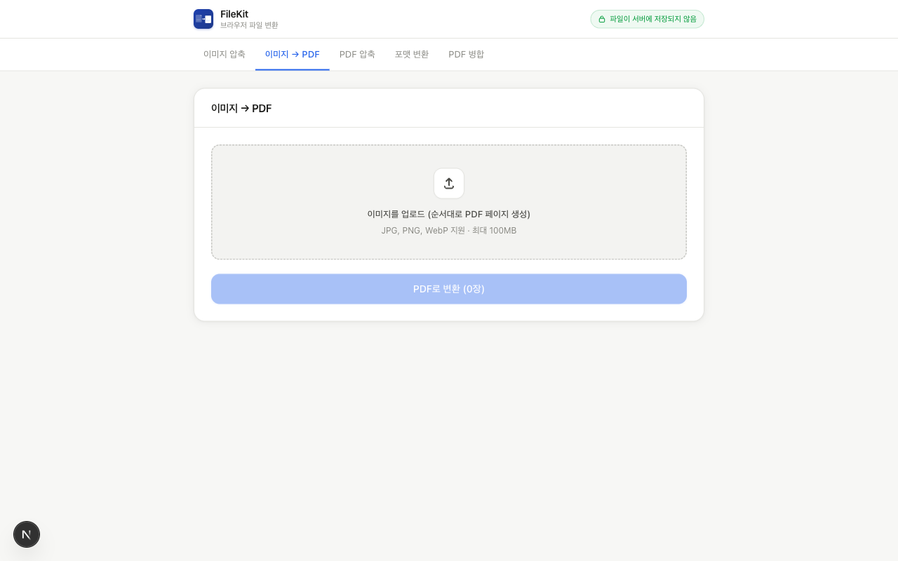
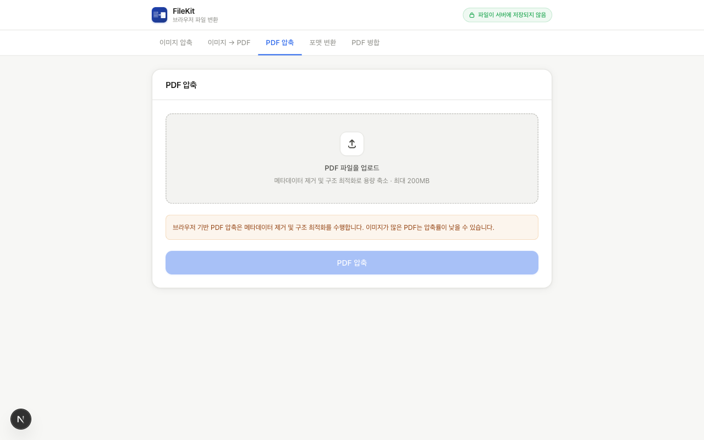
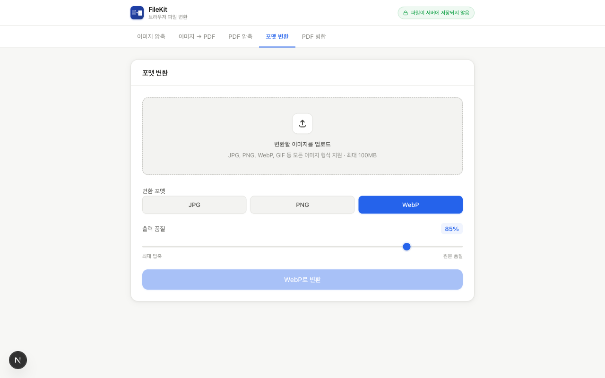
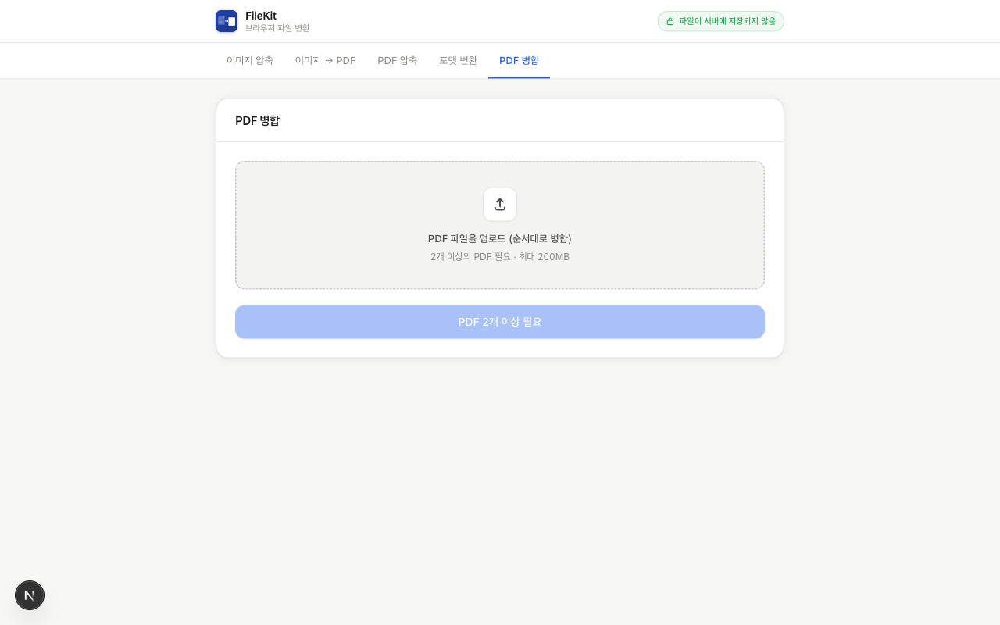

# FileKit

**파일이 서버로 전송되지 않는 브라우저 기반 파일 변환 도구**

이미지 압축, 포맷 변환, PDF 압축, PDF 병합, 이미지-PDF 변환 기능을 100% 클라이언트 사이드에서 처리합니다. 네트워크 전송 없이 모든 변환이 브라우저 내에서 완결됩니다.

---

## 목차

1. [기획 의도](#1-기획-의도)
2. [주요 기능](#2-주요-기능)
3. [기술 스택](#3-기술-스택)
4. [아키텍처](#4-아키텍처)
5. [폴더 구조](#5-폴더-구조)
6. [핵심 구현](#6-핵심-구현)
7. [로컬 실행](#7-로컬-실행)

---

## 1. 기획 의도

온라인 파일 변환 서비스는 파일을 서버에 업로드한 뒤 처리하는 방식이 일반적입니다. 이 구조는 사진, 계약서, 개인 문서 등 민감한 파일을 다룰 때 잠재적인 개인정보 리스크를 수반합니다.

FileKit은 이 문제를 다른 방향으로 접근합니다.

- **브라우저가 처리한다**: Canvas API, pdf-lib, jsPDF 등 브라우저에서 직접 실행 가능한 라이브러리만을 사용합니다.
- **네트워크를 거치지 않는다**: 변환 과정에서 파일은 메모리에만 존재하며 서버로 전송되지 않습니다.
- **설치가 필요 없다**: PWA로 구성되어 홈 화면 추가 후 오프라인에서도 사용 가능합니다.

---

## 2. 주요 기능

### 이미지 압축

JPG / PNG / WebP 이미지를 품질 슬라이더(10~100%)로 조절하여 압축합니다. 다중 파일을 병렬 처리하며, 원본 대비 압축률을 바로 확인할 수 있습니다.



**사용자 시나리오**
1. 이미지 파일을 드래그하거나 클릭하여 업로드
2. 품질 슬라이더로 압축 강도 조정 (기본값 80%)
3. 압축 버튼 클릭 → 원본/압축 크기 비교 결과 확인
4. 개별 또는 전체 다운로드

---

### 이미지 → PDF 변환

여러 이미지를 하나의 PDF로 변환합니다. 파일 목록에서 드래그로 순서를 조정할 수 있으며, 페이지 방향(세로/가로)은 이미지 비율에 따라 자동으로 결정됩니다.



**핵심 UX 포인트**
- 드래그 앤 드롭으로 페이지 순서 변경
- 위/아래 버튼으로도 순서 제어 가능
- 첫 번째 이미지의 파일명을 기반으로 출력 파일명 자동 생성

---

### PDF 압축

PDF 파일에서 불필요한 메타데이터를 제거하고 내부 객체를 스트림 방식으로 재직렬화하여 파일 크기를 줄입니다.



**기술적 특징**
- pdf-lib의 `useObjectStreams: true` 옵션으로 객체 스트림 압축
- 제목, 작성자, 키워드 등 메타데이터 일괄 제거
- 암호화 PDF, 손상된 PDF에 대해 구체적인 오류 메시지 제공

---

### 포맷 변환

이미지를 JPG, PNG, WebP 간에 변환합니다. PNG는 무손실 포맷이므로 품질 슬라이더가 자동으로 숨겨지며, PNG→JPG 변환 시 투명 영역은 흰색으로 처리됩니다.



---

### PDF 병합

여러 PDF를 지정한 순서대로 하나의 PDF로 병합합니다. 드래그 앤 드롭으로 병합 순서를 조정할 수 있습니다.



---

## 3. 기술 스택

### Frontend

| 기술 | 버전 | 선택 이유 |
|------|------|----------|
| **Next.js** | 16.1.7 | App Router + Turbopack 기반의 빠른 빌드, 정적 페이지로 배포 단순화 |
| **React** | 19.2.3 | 컴포넌트 기반 상태 관리, 탭별 독립적인 상태 격리 |
| **TypeScript** | 5 | 파일 처리 파이프라인의 타입 안전성, 라이브러리 API 오류 조기 발견 |
| **Tailwind CSS** | 4 | 유틸리티 클래스 기반의 빠른 UI 구성, CSS Variables와 병행 사용 |

### 파일 처리 라이브러리

| 기술 | 용도 | 선택 이유 |
|------|------|----------|
| **Canvas API** | 이미지 압축 / 포맷 변환 | 외부 의존성 없이 브라우저 네이티브로 처리 가능 |
| **pdf-lib** | PDF 압축 / PDF 병합 | 브라우저에서 PDF를 직접 생성·조작할 수 있는 순수 JS 라이브러리 |
| **jsPDF** | 이미지 → PDF 변환 | 이미지 배열을 PDF 페이지로 변환하는 데 최적화 |
| **react-dropzone** | 파일 드래그 앤 드롭 | 접근성(ARIA) 지원이 내장된 안정적인 파일 입력 컴포넌트 |

### PWA / 인프라

| 기술 | 용도 |
|------|------|
| **Service Worker** | Cache-first 전략으로 오프라인 지원, 앱 설치 후 네트워크 없이 사용 |
| **Web App Manifest** | 홈 화면 추가, PWA 바로가기(이미지 압축 / PDF 병합) 지원 |

### 백엔드 / 데이터베이스

없음. 모든 처리가 클라이언트 사이드에서 완결되며 서버 컴포넌트, API Route, 데이터베이스를 사용하지 않습니다.

### 배포

| 항목 | 내용 |
|------|------|
| **플랫폼** | Vercel (정적 빌드) |
| **빌드** | `next build` → 정적 HTML/JS 생성 |

---

## 4. 아키텍처

### 전체 데이터 흐름

```
사용자 파일 선택 (DropZone / FileListEditor)
        │
        ▼
useFileProcessor (상태 관리)
  ├── addFiles()        파일 크기 검증 (이미지 100MB / PDF 200MB)
  ├── moveFile()        드래그 앤 드롭 순서 변경
  ├── processFiles()    순차 또는 병렬 변환 실행
  │     ├── sequential: 파일 하나씩 순서대로 처리
  │     └── parallel:   concurrency 제한(기본 3개) 병렬 처리
  └── results[]         변환 완료된 Blob 배열
        │
        ▼
lib/ 변환 함수 (순수 함수, DOM/React 의존성 없음)
  ├── compressImage()       Canvas API → toBlob(quality)
  ├── convertImageFormat()  Canvas API → 포맷 지정 toBlob()
  ├── imagesToPdf()         jsPDF → 이미지 비율 기반 페이지 방향 결정
  ├── compressPdf()         pdf-lib → 메타데이터 제거 + 객체 스트림 압축
  └── mergePdfs()           pdf-lib → 페이지 복사 후 단일 PDF 생성
        │
        ▼
downloadBlob()  (URL.createObjectURL → <a> 클릭 → revokeObjectURL)
```

### 컴포넌트 구조

```
app/page.tsx
└── [activeTab] tool component (dynamic import, ssr: false)
      ├── DropZone               파일 입력
      ├── FileListEditor         순서 변경 가능한 파일 목록
      ├── QualitySlider          품질/파라미터 조절
      ├── ProgressBar            진행률 표시
      ├── ResultCard             변환 결과 + 다운로드
      ├── SizeDisplay            원본 ↔ 결과 크기 비교
      ├── FileThumb              파일 미리보기 썸네일
      └── ImageModal             이미지 전체화면 미리보기
```

### 설계 원칙

**1. lib/ 함수의 순수성 유지**

변환 로직은 `FileReader`, `Canvas`, `URL.createObjectURL` 등 브라우저 API만 사용하며 React나 DOM 참조에 의존하지 않습니다. 이 구조 덕분에 lib/ 함수는 어떤 React 컴포넌트에서도 재사용 가능하고 단독 테스트가 가능합니다.

**2. `next/dynamic` + `ssr: false`**

모든 tool 컴포넌트는 브라우저 전용 API(`FileReader`, `Canvas`, `PDF`)를 사용하므로 SSR 컨텍스트에서 실행될 수 없습니다. `dynamic import`를 통해 각 도구를 클라이언트에서만 lazy load하여 초기 번들 크기를 줄이고 SSR 오류를 방지합니다.

```typescript
const ImageCompress = dynamic(
  () => import("@/components/tools/ImageCompress"),
  { ssr: false }
);
```

**3. `useFileProcessor` 훅의 일반화**

5개 도구 모두 파일 입력 → 검증 → 처리 → 결과 표시라는 동일한 흐름을 따릅니다. 이 공통 패턴을 제네릭 훅으로 추출하여 각 도구는 변환 로직만 주입합니다.

```typescript
// 각 tool에서 변환 함수만 주입
await processFiles(
  async (file, _index, onProgress) => {
    const res = await compressImage(file, quality / 100, onProgress);
    return { file, blob: res.blob, originalSize: res.originalSize, ... };
  },
  { parallel: true }
);
```

---

## 5. 폴더 구조

```
filekit/
├── app/
│   ├── page.tsx          메인 페이지 — 탭 라우팅 + 동적 컴포넌트 로딩
│   ├── layout.tsx        루트 레이아웃 — PWA 메타데이터, Service Worker 등록
│   └── globals.css       전역 스타일 — CSS Variables 디자인 토큰, 슬라이더 커스텀
│
├── lib/                  순수 변환 함수 (DOM/React 의존성 없음)
│   ├── imageCompress.ts  Canvas API 기반 이미지 품질 압축
│   ├── imageConvert.ts   Canvas API 기반 포맷 변환 (JPEG / PNG / WebP)
│   ├── imageToPdf.ts     jsPDF 기반 이미지 → PDF 변환
│   ├── pdfCompress.ts    pdf-lib 기반 PDF 압축 및 PDF 병합
│   └── utils.ts          formatBytes, downloadBlob, validateFileSize 등 공통 유틸
│
├── hooks/
│   └── useFileProcessor.ts  파일 배치 처리 훅 — 순차/병렬, 진행률, 에러 관리
│
├── components/
│   ├── DropZone.tsx         드래그 앤 드롭 파일 입력 (react-dropzone)
│   ├── FileListEditor.tsx   순서 변경 가능한 파일 목록 (드래그 앤 드롭)
│   ├── FileThumb.tsx        이미지/PDF 파일 썸네일 미리보기
│   ├── ImageModal.tsx       이미지 전체화면 모달
│   ├── ProgressBar.tsx      처리 진행률 표시
│   ├── QualitySlider.tsx    압축/변환 품질 슬라이더
│   ├── ResultCard.tsx       변환 결과 카드 + 다운로드 버튼
│   ├── SizeDisplay.tsx      원본 ↔ 결과 파일 크기 비교
│   ├── SwRegister.tsx       Service Worker 등록
│   └── tools/
│       ├── ImageCompress.tsx
│       ├── ImageConvert.tsx
│       ├── ImageToPdf.tsx
│       ├── PdfCompress.tsx
│       └── PdfMerge.tsx
│
├── public/
│   ├── manifest.json    PWA 매니페스트 — 바로가기 2개 포함
│   ├── sw.js            Service Worker — Cache-first 전략
│   └── icons/
│       └── icon.svg     앱 아이콘
│
└── docs/
    └── assets/          README 스크린샷
```

---

## 6. 핵심 구현

### 이미지 압축 — Canvas `toBlob()`

외부 압축 라이브러리 없이 Canvas API의 `toBlob(mime, quality)` 파라미터로 JPEG 손실 압축을 직접 제어합니다. PNG는 무손실 포맷이므로 quality 파라미터가 무시됩니다.

```typescript
// lib/imageCompress.ts
canvas.toBlob(
  (blob) => resolve({ blob, originalSize: file.size, compressedSize: blob!.size }),
  isPng ? "image/png" : "image/jpeg",
  isPng ? undefined : quality  // PNG는 quality 무의미
);
```

PNG → JPEG 변환 시 투명 채널이 없어지므로 배경을 흰색으로 먼저 채웁니다.

```typescript
if (!isPng) {
  ctx.fillStyle = "#FFFFFF";
  ctx.fillRect(0, 0, canvas.width, canvas.height);
}
ctx.drawImage(img, 0, 0);
```

---

### PDF 압축 — 메타데이터 제거 + 객체 스트림

pdf-lib는 PDF를 로드하면 내부 객체 그래프를 메모리에 구성합니다. 이를 다시 직렬화할 때 `useObjectStreams: true` 옵션을 사용하면 여러 간접 객체를 하나의 스트림으로 묶어 파일 크기를 줄일 수 있습니다.

```typescript
// lib/pdfCompress.ts
const pdfDoc = await PDFDocument.load(arrayBuffer, { updateMetadata: false });

// 불필요한 메타데이터 제거
pdfDoc.setTitle(""); pdfDoc.setAuthor(""); pdfDoc.setSubject("");
pdfDoc.setKeywords([]); pdfDoc.setProducer(""); pdfDoc.setCreator("");

const bytes = await pdfDoc.save({
  useObjectStreams: true,   // 객체 스트림으로 묶어 압축
  addDefaultPage: false,
  objectsPerTick: 50,       // UI 블로킹 방지를 위한 청크 크기
});
```

---

### 병렬 처리 — Worker Pool 패턴

여러 파일을 처리할 때 단순 `Promise.all()`은 모든 파일을 동시에 처리하려 해서 대용량 이미지에서 메모리 압박이 생길 수 있습니다. `concurrency`를 제한하는 worker pool 패턴으로 동시 처리 수를 조절합니다.

```typescript
// hooks/useFileProcessor.ts
const worker = async (): Promise<void> => {
  while (true) {
    const i = taskIndex++;        // 원자적 인덱스 증가
    if (i >= files.length) break;
    out[i] = await processFn(files[i], i, onProgress);
  }
};

// concurrency(기본 3)개의 워커를 동시에 실행
await Promise.all(
  Array.from({ length: Math.min(concurrency, files.length) }, () => worker())
);
```

---

### PDF 오류 분류

암호화된 PDF와 손상된 PDF에 대해 사용자 친화적인 오류 메시지를 제공합니다. pdf-lib가 던지는 예외 메시지를 분석하여 오류 유형을 분류합니다.

```typescript
// lib/utils.ts
export function classifyPdfError(e: unknown): "encrypted" | "corrupted" | "unknown" {
  if (e instanceof Error) {
    const msg = e.message.toLowerCase();
    if (msg.includes("encrypt") || msg.includes("password")) return "encrypted";
    if (msg.includes("invalid") || msg.includes("corrupt") || msg.includes("parse")) return "corrupted";
  }
  return "unknown";
}
```

---

### PWA — URL 파라미터 기반 바로가기

`manifest.json`의 shortcuts 기능으로 홈 화면에서 특정 도구를 바로 실행할 수 있습니다. 앱 로드 시 URL 파라미터를 읽어 초기 탭을 설정합니다.

```typescript
// app/page.tsx
useEffect(() => {
  const params = new URLSearchParams(window.location.search);
  const tab = params.get("tab");
  if (tab && isTabId(tab)) setActiveTab(tab);
}, []);
```

```json
// public/manifest.json
"shortcuts": [
  { "name": "이미지 압축", "url": "/?tab=image-compress" },
  { "name": "PDF 병합",    "url": "/?tab=pdf-merge" }
]
```

---

## 7. 로컬 실행

```bash
# 의존성 설치
npm install

# 개발 서버 실행 (Turbopack)
npm run dev

# 프로덕션 빌드
npm run build

# 린트 검사
npm run lint
```

개발 서버는 기본적으로 `http://localhost:3000`에서 실행됩니다.

### 요구 사항

- Node.js 18 이상
- 모던 브라우저 (Canvas API, File API, Service Worker 지원 필요)
